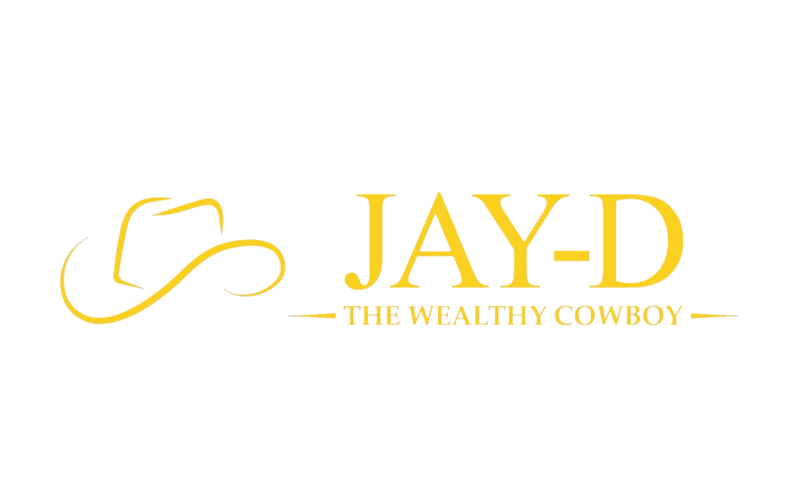

# JayD The Wealthy Cowboy™ | Global Credit Strategy



## Institutional Authority. Dimensional Performance.

JayD The Wealthy Cowboy™ is a premium, high-authority credit consulting platform built for Centaur Elite Consulting LLC. This repository contains the source code for the institutional multi-page experience, featuring a cinematic dimensional design and advanced funding strategies.

## ✨ Elite Features

- **Cinematic Dimensional Design**: Layered depth stack with custom gold dust aura and volumetric glows.
- **Institutional Authority**: Built with **Cinzel (Trajan)** typography for a monumental brand presence.
- **Advanced Funding Evaluation**: Integrated pre-qualification systems and strategic Fanbasis checkout mappings.
- **High-Performance Architecture**: Built with Next.js 15+, Tailwind CSS 4, and Framer Motion.
- **Legally Fortified**: Fully integrated Terms, Privacy (TCPA), and Refund policies.

## 🛠 Tech Stack

- **Framework**: [Next.js 15 (App Router)](https://nextjs.org/)
- **Styling**: [Tailwind CSS 4](https://tailwindcss.com/)
- **Animations**: [Framer Motion](https://www.framer.com/motion/)
- **Icons**: [Lucide React](https://lucide.dev/)
- **Typography**: Cinzel (Trajan), Inter, DM Sans

## 🚀 Getting Started

Follow these steps to set up the development environment locally:

1. **Clone the repository**:
   ```bash
   git clone <your-repo-url>
   ```

2. **Install dependencies**:
   ```bash
   npm install
   ```

3. **Run the development server**:
   ```bash
   npm run dev
   ```

4. **View the platform**:
   Open [http://localhost:3000](http://localhost:3000) in your browser.

## ⚖️ Legal & Compliance

This platform is operated by **Centaur Elite Consulting LLC**. All services are provided on a month-to-month basis and are subject to the authorized Terms and Conditions and Refund Policy integrated into the site.

---
© 2026 CENTAUR ELITE CONSULTING LLC. ALL RIGHTS RESERVED.
BUILT FOR EXCELLENCE.
